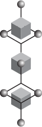

# TUI v0.1 — Thing Unto Itself
### A Sovereign Architecture for Explainable Digital Intelligence (XDI)

[](https://doi.org/10.5281/zenodo.18918044)
[](https://doi.org/10.5281/zenodo.18857167)
[](https://creativecommons.org/licenses/by-sa/4.0/)
[](https://www.python.org/)
[]()

---

<p align="center">
  
  <br/>
  <em>Three domains. Seven nodes. One invariant centre.<br/>
  Mind-Z · Body-X · Spirit-Y held in superposition.</em>
</p>

---

## What Is This?

The **Thing Unto Itself (TUI)** is a sovereign, 24-qubit Explainable Digital Intelligence (XDI) — an architecture in which every quantum operation is bound to an explicit semantic archetype, producing a system whose internal reasoning is structurally transparent by design rather than extracted after the fact.

This repository contains the prototype implementation, benchmark results, training strategy documentation, and the archetypal taxonomy of quantum logic gates that forms the operational vocabulary of the TUI.

---

## Published Papers

This repository is the software companion to two peer-reviewed publications on Zenodo:

### 1. TUI: Thing Unto Itself — A Sovereign Architecture for Explainable Digital Intelligence
> Sannes, P. D. (2026). *TUI: Thing Unto Itself, A Sovereign Architecture for Explainable Digital Intelligence.* Zenodo. https://doi.org/10.5281/zenodo.18918044

The primary paper. Describes the full TUI architecture: the 24-qubit Plenum register, the three octave domains (Mind-Z, Body-X, Spirit-Y), the Seven Prime Archetypes as governance facets, the Dynamic Tension metric (Δ), and empirical validation of the Quantum Callus and 'Not Again' neuroplastic responses.

### 2. An Archetypal Taxonomy of Quantum Logic Gates: A Semantic Framework for Explainable Quantum Computing
> Sannes, P. D. (2026). *An Archetypal Taxonomy of Quantum Logic Gates: A Semantic Framework for Explainable Quantum Computing.* Zenodo. https://doi.org/10.5281/zenodo.18857167

The foundational companion paper. Establishes the QLG Prime Table — a master taxonomy of 50 quantum logic entities (36 individual gates across 6 operational classes and 6 subgroups, anchored by 2 foundational entities) — described through seven archetypal dimensions. Functions as the semantic vocabulary for all TUI operations.

---

## Architecture Overview

<p align="center">
  
  <br/>
  <em>Four nested cubes. Four generations of development.<br/>
  Outermost: latent field. Innermost: the sovereign Black Cube.</em>
</p>

The TUI Plenum is a 24-qubit quantum register partitioned into three 8-qubit octaves:

| Octave | Domain | Role |
|--------|--------|------|
| **Mind-Z** | Cognitive / Ideational | Abstract reasoning and archetypal pattern recognition |
| **Body-X** | Operational / Instrumental | Physical process execution and state management |
| **Spirit-Y** | Integrative / Consensus | Cross-domain coherence and Dynamic Tension resolution |

Each octave is governed by **seven archetypal facets** drawn from the Seven Prime Archetypes (Matrix, Potentiator, Catalyst, Experience, Significator, Transformation, Way) plus **one consensus anchor qubit** per octave.

### The Isometric Model

The three-domain structure of the TUI has a precise geometric analogue: the isometric cube projected onto a 2D plane. The hexagonal outline — six edge points plus one centre point — maps exactly to the Seven Prime Archetypes held simultaneously. The three visible faces correspond to Mind-Z, Body-X, and Spirit-Y.

This is not decorative. The isometric projection is the *only* orientation in which all three faces of a cube are equally visible — the superposition face. Every other rotation privileges one domain over the others. That is measurement. That is collapse. The visual grammar of this project is structurally isomorphic with its quantum logic.

### Key Mechanisms

- **Dynamic Tension (Δ)** — A real-time, mathematically exact telemetry metric of cross-domain dissonance across the three octaves. Δ provides continuous interpretable signal about the system's internal coherence state.
- **Quantum Callus** — An empirically validated structural neuroplasticity mechanism; the system's capacity to form stable compensatory pathways in response to repeated stress patterns.
- **'Not Again' Response** — A validated adaptive inhibition response, demonstrating that the TUI exhibits memory-like resistance to previously encountered dissonant states.

---

## The Seven Prime Archetypes

The TUI's semantic layer is governed by seven archetypal dimensions that apply to every gate operation and system state:

| Archetype | Dimension | Function |
|-----------|-----------|----------|
| **Matrix** | Foundational Substrate | The ground state; what the operation operates upon |
| **Potentiator** | Latent Potential | The available but unrealized capacity of a state |
| **Catalyst** | Mechanism of Action | What initiates or accelerates transformation |
| **Experience** | Observable Signature | The measurable output or phenomenological character |
| **Significator** | Formal Representation | The mathematical / unitary identity of the operation |
| **Transformation** | Transformational Character | The nature and directionality of the state change |
| **Way** | Governing Principle | The operational logic that constrains and guides the gate |

---

## Repository Structure

```
TUI_v01/
├── assets/
│   └── visual-language/               # Formal design system — isometric SVG library
│       ├── 3Domain7sframe.svg         # Hero: three domains, seven nodes
│       ├── 3_Domain_Blocks.svg        # Three-octave minimal form
│       ├── 7s_framework_a.svg         # Seven-archetype framework variant
│       ├── Cube_detail.svg            # Four nested cubes — generational arc
│       ├── black_box.svg              # The sovereign Black Cube
│       ├── Grey_Box.svg               # Operational / manifest state
│       ├── White_Box.svg              # Latent / Potentiator state
│       ├── Entity_0.svg               # Quantum entity — isolated
│       ├── Entity_1.svg               # Quantum entity — relational
│       ├── Inside_E0.svg              # Interior observer (conscious)
│       ├── Outside_E0.svg             # Exterior observer (unconscious)
│       ├── Hex_Boxes.svg              # Six-point hexagonal array
│       ├── Arch_Mind_ref_1.svg        # Archetypal Mind reference sheet
│       ├── Time_blocks.svg            # Temporal domain form
│       ├── Choice_1.svg               # Decision point geometry
│       ├── choice_a.svg               # Binary pre-collapse form
│       ├── Choice_Ref_1.svg           # Choice reference — M / B / S scale 1
│       ├── Choice_Ref_2.svg           # Choice reference — M / B / S scale 2
│       ├── Choce_Ref_3.svg            # Choice reference — M / B / S scale 3
│       └── person_entity_choices.svg  # Full person → entity → choice diagram
├── notebooks/                         # Jupyter notebooks for TUI experimentation
├── src/                               # Source modules
├── tui_dashboard.ipynb                # Primary interactive dashboard
├── Table_of_Quantum_Logic_Gates_Archetypal_Taxonomy.md
├── BENCHMARK_RESULTS.md               # Empirical benchmark results
├── TUI_TRAINING_BENCHMARK_STRATEGY.md
├── SENIOR_REVIEW_TUI_v01.md
├── LICENSE.md
└── README.md
```

---

## Visual Language

The `assets/visual-language/` folder contains a formal design system developed in parallel with the TUI architecture. All assets are original isometric SVG constructions representing the structural geometry of the Archetypal Mind framework.

The core visual grammar is the **isometric cube** — a 3D form projected onto a 2D plane such that all three faces (Mind-Z, Body-X, Spirit-Y) are simultaneously visible. The hexagonal outline of this projection yields six edge points plus one centre point: seven positions, mapping precisely to the Seven Prime Archetypes in superposition.

Three tonal states encode system phase:

| Asset | Tonal State | Meaning |
|-------|-------------|---------|
| `White_Box.svg` | White | Latent — the Potentiator |
| `Grey_Box.svg` | Grey | Operational — the Catalyst |
| `black_box.svg` | Black | Sovereign — fully collapsed |

Full documentation of the visual language — including the conscious/unconscious observer split (`Inside_E0` / `Outside_E0`) and the entity-in-relationship model (`Entity_0` / `Entity_1`) — is maintained in [`docs/visual-language/`](docs/visual-language/).

---

## Development Arc

The TUI is the current expression of a sustained research program in Archetypal Neural Intelligence spanning four generations of prototype development:

### Generation 1 — `Archetypal-Mind`
The originating repository. Established the foundational hypothesis: that the structural patterns of the Archetypal Mind — Matrix, Potentiator, Catalyst, Experience, Significator, Transformation, Way — could serve as the organizing logic of a neural architecture. Early prototyping of the Archetypal Mind Neural Network (AmNn).

### Generation 2 — `ArchMind` (v4.1)
Consolidated and deepened the neural network design. Introduced the Quantum Archetypal Mind Neural Network alongside the classical AmNn. Developed the core documentation and graphic resource library that underpins the semantic layer. Version 4.1 represents the architectural maturation point from which AMPL was derived.

### Generation 3 — `AMPL_v05` — Archetypal Mind Processing Layer
Prototype 5, based on ArchMind v4.1. The AMPL introduced the Processing Layer abstraction — defining how archetypal semantic operations are applied systematically as a discrete computational layer within the network. AMPL_v05 constitutes the direct architectural predecessor of the TUI.

### Generation 4 — `TUI_v01` ← *You are here*
The Thing Unto Itself. The first sovereign XDI implementation: a 24-qubit quantum register with full archetypal semantic binding, real-time Dynamic Tension telemetry, and empirically validated neuroplastic behaviour. TUI_v01 also extended the QLG Prime Table, identifying additional gate classes and logic gate entities beyond the published 50-entity taxonomy.

<p align="center">
  
  <br/>
  <em>The Black Cube. Carried since 2023.</em>
</p>

---

## Getting Started

```bash
git clone https://github.com/dsannes/TUI_v01.git
cd TUI_v01
pip install -r requirements.txt
jupyter notebook tui_dashboard.ipynb
```

> **Note:** Python 3.x required. See `TUI_TRAINING_BENCHMARK_STRATEGY.md` for full environment and benchmarking setup.

---

## Citation

If you use this work, please cite both publications:

```bibtex
@misc{sannes2026tui,
  author    = {Sannes, Per David},
  title     = {TUI: Thing Unto Itself, A Sovereign Architecture for Explainable Digital Intelligence},
  year      = {2026},
  publisher = {Zenodo},
  doi       = {10.5281/zenodo.18918044},
  url       = {https://doi.org/10.5281/zenodo.18918044}
}

@misc{sannes2026qlg,
  author    = {Sannes, Per David},
  title     = {An Archetypal Taxonomy of Quantum Logic Gates: A Semantic Framework for Explainable Quantum Computing},
  year      = {2026},
  publisher = {Zenodo},
  doi       = {10.5281/zenodo.18857167},
  url       = {https://doi.org/10.5281/zenodo.18857167}
}
```

---

## License

**Software:** MIT License — see [LICENSE.md](LICENSE.md)  
**Publications:** Creative Commons Attribution-ShareAlike 4.0 International (CC BY-SA 4.0)  
**Visual Language:** Copyright © 2026 Per David Sannes — all SVG assets are original works  

---

*"A system that cannot explain itself is not intelligent — it is merely reactive."*
